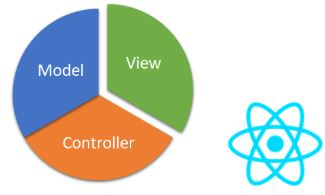
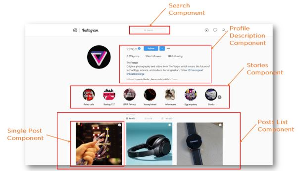
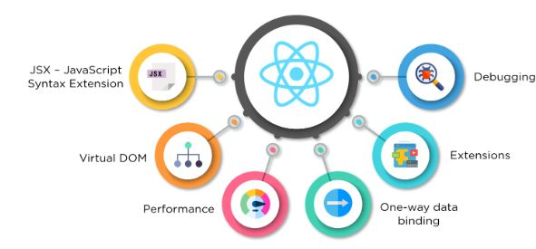
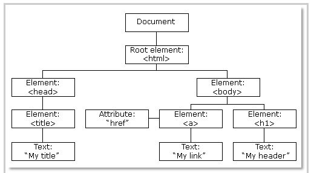
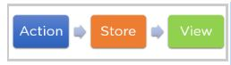
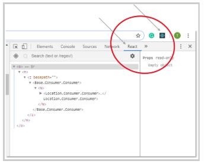
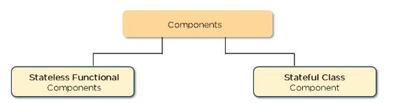
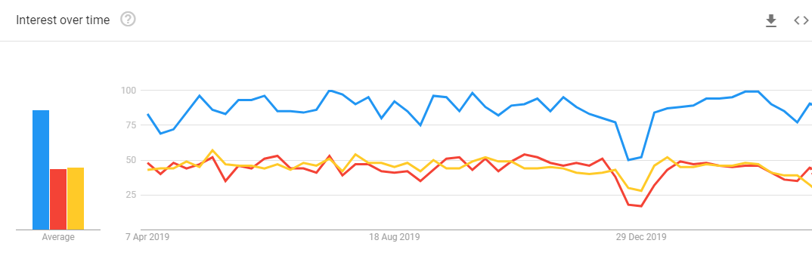

 React is the most popular front-end JavaScript library in the field of web development. It is used by large, established companies and newly-minted startups alike (Netflix, Airbnb, Instagram, and the New York Times, to name a few). React brings many advantages to the table, making it a better choice than other frameworks like Angular.js.

If you’re new to ReactJS or just refreshing yourself on the core concepts, this material will give you an introduction to all of React’s fundamentals.

## What is React?

- React is a JavaScript library created by Facebook
- React is a User Interface (UI) library
- React is a tool for building UI components

React is a JavaScript library created for building fast and interactive user interfaces for web and mobile applications. It is an open-source, component-based, front-end library responsible only for the application’s view layer. In Model View Controller (MVC) architecture, the view layer is responsible for how the app looks and feels. React was created by Jordan Walke, a software engineer at Facebook.



Let’s take a look at an Instagram webpage example, entirely built using React, to get a better understanding of how React works. As the illustration shows, React divides the UI into multiple components, which makes the code easier to debug. This way, each component has its property and function.



## Why React?

React’s popularity today has eclipsed that of all other front-end development frameworks. Here is why:

- **Easy creation of dynamic applications:** React makes it easier to create dynamic web applications because it requires less coding and offers more functionality, as opposed to JavaScript, where coding often gets complex very quickly.
- **Improved performance:** React uses Virtual DOM, thereby creating web applications faster. Virtual DOM compares the components’ previous states and updates only the items in the Real DOM that were changed, instead of updating all of the components again, as conventional web applications do.
- **Reusable components:** Components are the building blocks of any React application, and a single app usually consists of multiple components. These components have their logic and controls, and they can be reused throughout the application, which in turn dramatically reduces the application’s development time.
- **Unidirectional data flow:** React follows a unidirectional data flow. This means that when designing a React app, developers often nest child components within parent components. Since the data flows in a single direction, it becomes easier to debug errors and know where a problem occurs in an application at the moment in question.
- **Small learning curve:** React is easy to learn, as it mostly combines basic HTML and JavaScript concepts with some beneficial additions. Still, as is the case with other tools and frameworks, you have to spend some time to get a proper understanding of React’s library.
- **It can be used for the development of both web and mobile apps:** We already know that React is used for the development of web applications, but that’s not all it can do. There is a framework called React Native, derived from React itself, that is hugely popular and is used for creating beautiful mobile applications. So, in reality, React can be used for making both web and mobile applications.
- **Dedicated tools for easy debugging:** Facebook has released a Chrome extension that can be used to debug React applications. This makes the process of debugging React web applications faster and easier.

The above reasons more than justify the popularity of the React library and why it is being adopted by a large number of organizations and businesses. Now let’s familiarize ourselves with React’s features.

## Features of React



### JSX - JavaScript Syntax Extension

JSX is a syntax extension to JavaScript. It is used with React to describe what the user interface should look like. By using JSX, we can write HTML structures in the same file that contains JavaScript code. This makes the code easier to understand and debug, as it avoids the usage of complex JavaScript DOM structures.

```jsx
const name = 'Student`;
const greet = <h1>Hello, {name}</h1>;
```

The above code shows how JSX is implemented in React. It is neither a string nor HTML. Instead, it embeds HTML into JavaScript code.

### Virtual DOM

React keeps a lightweight representation of the “real” DOM in the memory, and that is known as the “virtual” DOM (VDOM). Manipulating real DOM is much slower than manipulating VDOM because nothing gets drawn on the screen. When the state of an object changes, VDOM changes only that object in the real DOM instead of updating all of the objects. 

It may all seem a bit overwhelming for now, so let’s first understand what DOM is, and then we’ll go through how VDOM and real DOM interact with each other.

- **What is the Document Object Model (DOM)?** DOM (Document Object Model) treats an XML or HTML document as a tree structure in which each node is an object representing a part of the document.
    

- **How do Virtual DOM and React DOM interact with each other?** When the state of an object changes in a React application, VDOM gets updated. It then compares its previous state and then updates only those objects in the real DOM instead of updating all of the objects. This makes things move fast, especially when compared to other front-end technologies that have to update each object even if only a single object changes in the web application.

### Performance

React uses VDOM, which makes the web applications run much faster than those developed with alternate front-end frameworks. React breaks a complex user interface into individual components, allowing multiple users to work on each component simultaneously, thereby speeding up the development time. 

### Extensions

React goes beyond simple UI design and has many extensions that offer complete application architecture support. It provides server-side rendering, which entails rendering a normally client-side only web application on the server, and then sends a fully rendered page to the client. It also employs Flux and Redux extensively in web application development. Finally, there is React Native, a popular framework derived from React, used to create cross-compatible mobile applications.

### One-way data binding

React’s one-way data binding keeps everything modular and fast. A unidirectional data flow means that when a developer designs a React app, they often nest child components within parent components. This way, a developer knows where and when an error occurs, giving them better control of the whole web application.



### Debugging

React applications are easy to test due to a large developer community. Facebook even provides a small browser extension that makes React debugging faster and easier.



This extension, for example, adds a React tab in the developer tools option within the Chrome web browser. The tab makes it easy to inspect React components directly.

Now, let’s take a look at React’s important concepts.

## Components, State, and Props

### Components

Components are the building blocks of any React application, and a single app usually consists of multiple components. A component is essentially a piece of the user interface. React splits the UI into independent, reusable parts that can be processed separately.

There are two types of components in React:



- **Functional Components:** These components have no state of their own and only contain a render method, so they are also called stateless components. They may derive data from other components as props (properties).

    ```jsx
    function Greeting(props) {
      return <h1>Welcome to {props.name}</h1>;
    }
    ```

- **Class Components:** These components can hold and manage their state and have a separate render method for returning JSX on the screen. They are also called stateful components, as they can have a state.

    ```jsx
    class Greeting extends React.Component {
      render() {
        return <h1>Welcome to {this.props.name}</h1>;
      }
    }
    ```

### State

The state is a built-in React object that is used to contain data or information about the component. A component’s state can change over time; whenever it changes, the component re-renders. The change in state can happen as a response to user action or system-generated events, and these changes determine the behavior of the component and how it will render.  

  ```jsx
  class Greetings extends React.Component {
    state = {
      name: "World"
    };

    updateName() {
      this.setState({ name: "Simplilearn" });
    }

    render() {
        return(
            <div>
                {this.state.name}
            </div>
        )
    }
  }
  ```

### Props

Props are short for properties. It is a React built-in object which stores the value of a tag’s attributes and works similar to the HTML attributes. It provides a way to pass data from one component to other components in the same way as arguments are passed in a function.

- **Passing props to other components:** carProp, bikeProp

    ```jsx
    import React from 'react';
    import ReactDom from 'react-dom';
    import App from './App.jsx';

    ReactDOM.render(<App carProp="1600 cc" bikeProp="150 cc" />,
      document.getElementById('app');
    );

    export default App;
    ```

- **Accessing props passed to a functional component:** this.props.carProp, this.props.bikeProp

    ```jsx
        import React from 'react';

        const App = (props) => {
          const {carProp, bikeProp} = props;

          return(
            <div>
              Car {carProp}
              Bike {bikeProp}
            </div>
          )
        }
    ```

## ReactJS Prerequisites

Here are some of the concepts that you should be familiar with, to one degree or another:

- Programming concepts like functions, objects, arrays, and to a lesser extent, classes
- Basic knowledge of JavaScript
- Some familiarity with HTML
Now that you know what concepts you should already be familiar with before working on React, let’s take a look at the industry trends.

## Industry Trends

"React" has become the latest buzzword in the front-end development community, reflecting its steadily increasing use among developers.

- React developers earn more money in comparison to other web development technologies. Due to the fast rendering of React applications, more and more companies are adopting this development tool, and this has subsequently led to a higher demand for React developers all around the world.

    > The average salary for a [React developer across United States](https://www.payscale.com/research/US/Skill=React.js/Salary) is a whopping USD 91,000 per year!

    > The average salary for a [React developer across Canada](https://www.payscale.com/research/CA/Skill=React.js/Salary) is a whopping CAD 70,000 per year!

- React has been consistently gaining popularity since it was released, and, as the following Google trends chart shows, there’s no sign of it slowing down. Facebook keeps adding features to React, making it increasingly more potent over time. It is safe to assume that React is here to stay. [Check it on Google Trends](https://trends.google.com/trends/explore?geo=CA&q=React,Angular,Vue)

    

## Creating your first React Application

- We will follow the [Create React App](https://create-react-app.dev/docs/getting-started/) guide along with the [React Tutorial](https://reactjs.org/tutorial/tutorial.html).

- To enable bootstrap we will use [React Bootstrap](https://react-bootstrap.github.io/getting-started/introduction).

- An step futher will be to use [TypeScript in your react app](https://create-react-app.dev/docs/adding-typescript/).
